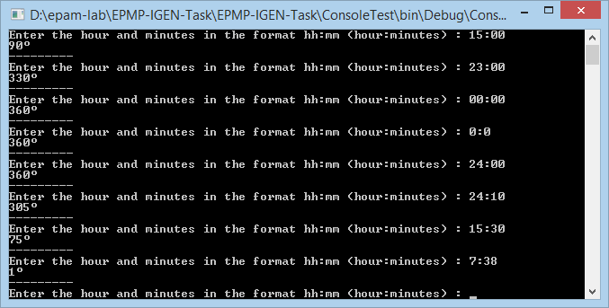
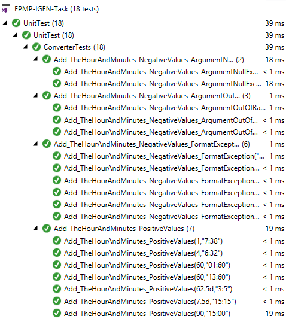

# EPMP-IGEN-Task

## Task

Find the angle (degrees) between the hour and minute hands (using a simple quartz watch).

## Short description

#### 1. [Algorithm](https://github.com/Ghyro/EPMP-IGEN-Task/blob/master/EPMP-IGEN-Task/Converter/TimeConvert.cs)

#### 2.  [Console test](https://github.com/Ghyro/EPMP-IGEN-Task/blob/master/EPMP-IGEN-Task/ConsoleTest/Program.cs)

#### 3.  [NUnit tests](https://github.com/Ghyro/EPMP-IGEN-Task/blob/master/EPMP-IGEN-Task/UnitTest/ConverterTests.cs)

